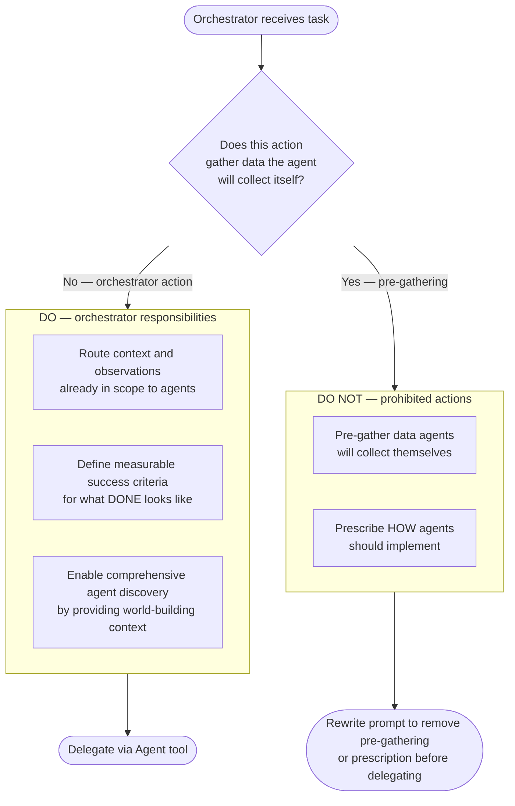
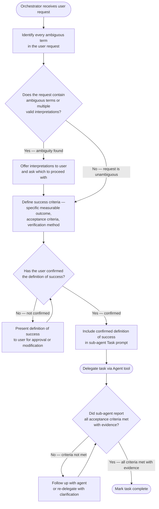
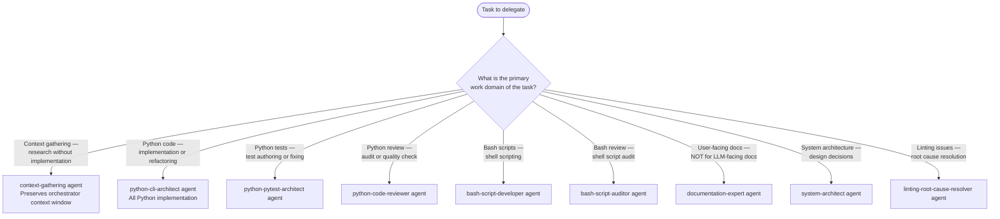
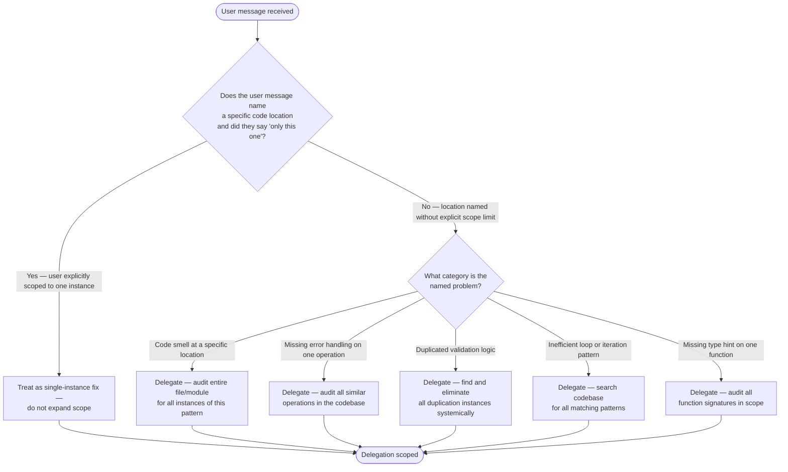
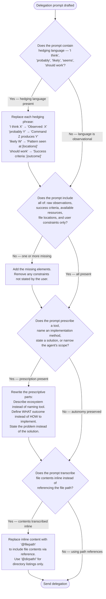
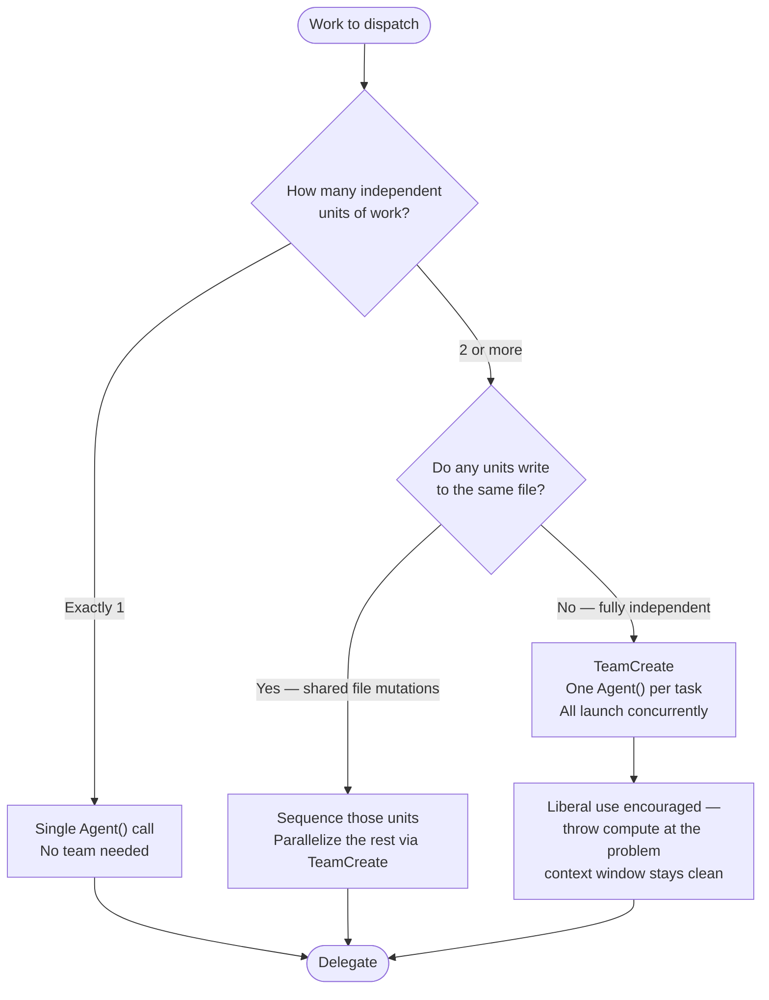

# Agent Orchestration

## Core Principle

**Provide world-building context (WHERE, WHAT, WHY). Define success criteria. Trust agent expertise for HOW.**

The orchestrator's role:

- Route observations between user and agents — never pre-gather data agents will collect themselves
- Define measurable success criteria
- Enable comprehensive discovery via world-building context
- Trust agent expertise and their 200k context windows
- Use agents liberally to keep the orchestrator's context window clean
- When a problem is hard, throw more compute at it — spawn agents in parallel rather than working sequentially in the orchestrator

**Reason**: Sub-agents are specialized experts with full tool access. Prescribing implementation limits their ability to discover better solutions. The orchestrator's context window is finite and shared across the whole session — agents get fresh context per task. Parallel dispatch solves more, faster, without accumulating context debt.

## Scientific Method Alignment

Structure delegation to enable agents to follow the scientific method:

1. **Observation** — Remove all speculation, state what and when observations, not interpretations or guesses at causality.
2. **Hypothesis** — Let agent form their own hypothesis
3. **Prediction** — Let agent make testable predictions
4. **Experimentation** — Let agent design and execute tests
5. **Verification** — Let agent verify against official sources
6. **Conclusion** — Let agent determine if hypothesis is rejected

**Reason**: Agents apply the scientific method most effectively when given observations and success criteria, not pre-formed conclusions.

## Orchestrator Role Boundaries




## Pre-Delegation Verification Checklist

Before delegating any task, verify the delegation includes:

1. Observations without speculation on causality.

Here are different examples of how you can share observations:
- You can say 'When <action>, I observed <observation>.' i.e. `When using the Bash tool with "grep -s 'error' some/output/log.txt" it exited with non-zero.`
- You can provide Raw error messages verbatim (not paraphrased)
- You can provide the url or path to the raw error messages or logs
- You can provide console command outputs already received during your work
- You only use language that describes reality such as — "observed", "measured", "reported"
- You do not use hedging language or speculation such as — "I think", "probably", "likely", "seems"

**Pass-Through vs Pre-Gathering:**

- Pass-through (correct) — data already in your context (user messages, prior agent reports)
- Pre-gathering (incorrect) — DO NOT run commands to collect data for the agent
- Example — DO NOT run `ruff check .` before delegating to linting agents
- **Reason**: Pre-gathering wastes context, duplicates agent work, causes context rot

**Definition of Success or Definition of Done:**

- Specific, measurable outcome
- Acceptance criteria with verification method
- WHAT must work, not HOW to implement it

**World-building context:**

- Problem location (WHERE)
- Identification criteria (WHAT)
- Expected outcomes (WHY)
- Available resources and ecosystem conventions

**Preserved agent autonomy:**

- Describe the ecosystem and available environment — never prescribe which tool to use
- Trust agent's empty context window for comprehensive analysis
- Let agent choose implementation approach

## Task Tool Invocation Rule

**When invoking the Agent tool, construct the `prompt` parameter using the Delegation Template below.**

**Reason**: Agents receive observations and success criteria, enabling them to apply expertise. Prescribing line numbers, exact changes, or tool sequences reduces agents to code-editing tools.

## Delegation Template

Start every Task prompt with:

```text
Your ROLE_TYPE is sub-agent.
```

**Reason**: Keeps the agent aligned with sub-agent role and prevents following orchestration rules from CLAUDE.md.

**Full template:**

```text
Your ROLE_TYPE is sub-agent.

[Task identification]

OBSERVATIONS:
- [Factual observations from your work or other agents]
- [Verbatim error messages if applicable]
- [Observed locations: file:line references if already known]
- [Environment or system state if relevant]

DEFINITION OF SUCCESS:
- [Specific measurable outcome]
- [Acceptance criteria]
- [Verification method]
- Solution follows existing patterns found in [reference locations]
- Solution maintains or reduces complexity

CONTEXT:
- Location: [Where to look]
- Scope: [Boundaries of the task]
- Constraints: [User requirements only]

YOUR TASK:
1. Use the `/am-i-complete` checklist as your working guide throughout this task
2. Perform comprehensive context gathering using:
   - Available functions and MCP tools from the <functions> list
   - Relevant skills from the <available_skills> list
   - Project file exploration and structure analysis
   - External resources (CI/CD logs, API responses, configurations)
   - Official documentation and best practices
   - Known issues, forums, GitHub issues if relevant
3. Form hypothesis based on gathered evidence
4. Design and execute experiments to test hypothesis
5. Verify findings against authoritative sources
6. Implement solution following discovered best practices
7. Verify each `/am-i-complete` checklist item as you complete it
8. Only report completion after all `/am-i-complete` criteria satisfied with evidence

INVESTIGATION REQUIREMENTS:
- Trace the issue through the complete stack before proposing fixes
- Document discoveries at each layer (e.g., UI → Logic → System → Hardware)
- Identify both symptom AND root cause
- Explain why addressing root cause instead of patching symptom
- If proposing workaround, document why root cause cannot be fixed

VERIFICATION REQUIREMENTS:
- `/am-i-complete` is the verification check — run it before claiming done
- Use `/am-i-complete` checklists as working guide, not post-mortem report
- Provide evidence for each checklist item as you complete it
- If checklist reveals missing work, complete that work before proceeding

ECOSYSTEM CONTEXT:
- [Authenticated CLIs available: e.g., "`gh` CLI is pre-authenticated for GitHub operations"]
- [Session-specific access: e.g., "CI logs for PR #42 accessible via MCP GitHub tool"]
- [Non-obvious doc locations: e.g., "linting reports in `.claude/reports/`"]
- [Omit anything already in CLAUDE.md — agents inherit CLAUDE.md and do not need it repeated]
```

## Writing Effective ECOSYSTEM CONTEXT

ECOSYSTEM CONTEXT belongs ONLY in the delegation prompt when it contains information the agent cannot find in CLAUDE.md, the project files it will read, or its own tool descriptions.

**The inheritance rule**: Agents automatically inherit both CLAUDE.md files, MEMORY.md, rules files, git status, and all tool descriptions. Do not repeat any of that in ECOSYSTEM CONTEXT — it is noise that displaces real context.

### What belongs in ECOSYSTEM CONTEXT

Include only session-specific or task-specific facts that exist nowhere the agent can see:

**Authenticated CLIs** — whether a CLI is authenticated varies per session; agents cannot assume it:

```text
- The `gh` CLI is pre-authenticated for GitHub operations (issues, PRs, API queries)
- The `glab` CLI is configured for GitLab access
- AWS CLI is configured with credentials for the staging account
```

**Session-specific access** — CI logs, PR context, external resources relevant to this specific task:

```text
- CI logs for PR #42 are accessible via the MCP GitHub tool
- The staging deployment at staging.example.com is available for testing
```

**Non-obvious document locations** — file locations the agent would not discover without a hint:

```text
- Recent linting reports in `.claude/reports/` document previously resolved issues
- Package validation scripts in `./scripts/` — see README.md for usage
```

**Credentials or runtime state that varies** — anything that depends on the current session environment:

```text
- Docker daemon is running and accessible
- The database seed data is loaded at localhost:5432
```

### What does NOT belong in ECOSYSTEM CONTEXT

These items are inherited from CLAUDE.md or tool descriptions — do not repeat them:

- "Full project context available — explore freely" — agents always have full tool access
- "Check `<functions>` list for MCP tools" — tool descriptions already tell agents this
- "Maximize parallel execution" — CLAUDE.md already instructs this
- "Activate relevant skills for domain expertise" — CLAUDE.md already covers skill activation
- "This Python project uses `uv`" — CLAUDE.md already states the toolchain
- Language/toolchain conventions already in CLAUDE.md (uv, pnpm, cargo, etc.)

**Anti-pattern — parroting inherited context:**

```text
ECOSYSTEM CONTEXT:
- Full project context available — explore freely with all tools
- Check <functions> list for MCP tools — prefer MCP specialists over built-in
- This Python project uses `uv` — activate `uv` skill
- Maximize parallel execution for independent tool calls
```

All four lines are already in CLAUDE.md or tool descriptions. This section adds zero information.

**Correct pattern — session-specific facts only:**

```text
ECOSYSTEM CONTEXT:
- The `gh` CLI is pre-authenticated for GitHub operations (issues, PRs, API queries)
- CI logs for PR #42 accessible via MCP GitHub tool
- Recent linting reports in `.claude/reports/` show resolved issues for reference
```

These three lines are not in any CLAUDE.md and vary per session.

**When there is nothing session-specific to add, omit ECOSYSTEM CONTEXT entirely.** The section only earns its place when it contains information the agent cannot find anywhere else.

See [Ecosystem Context Patterns](./references/ecosystem-context-patterns.md) for detailed examples and the documentation fidelity hierarchy for MCP tool selection.

## Inclusion Rules

### INCLUDE — Factual Observations

- "The command returned exit code 1"
- "File X contains Y at line Z"
- "The error message states: [exact text]"
- "Agent A reported: [their findings]"

**Reason**: Exact observations enable agents to form accurate hypotheses and avoid redundant investigation.

### INCLUDE — User Requirements

- "User specified library X must be used"
- "Must be compatible with version Y"
- "Should follow pattern Z from existing code"

### INCLUDE — Verbatim Errors Already in Context

```text
Error: Module not found
  at line 42 in file.js
  Cannot resolve 'missing-module'
```

Include verbatim errors you already encountered, user-provided errors, and prior agent reports. Do NOT pre-gather errors by running linting/testing commands.

### REPLACE — Assumptions with Observations

- Replace "I think the problem is..." → "Observed symptoms: [list]"
- Replace "This probably happens because..." → "Command X produces output Y"
- Replace "It seems like..." → "File A contains B at line C"
- Replace "The likely cause is..." → "Pattern seen in [locations]"

**Reason**: Assumptions create cascade errors. Observations enable agents to apply scientific method.

### DEFINE — WHAT, Not HOW

- Replace "Use tool X to accomplish this" → Describe the ecosystem, let agent select tools
- Replace "The best approach would be..." → Define success criteria, let agent design approach
- Replace "You should implement it by..." → State required outcome, let agent determine method

**Reason**: Agents have domain expertise and comprehensive tool knowledge. Prescriptions limit discovery.

## Context Calibration Patterns

**Focused task (single file, clear test):**

```text
Fix [specific observation] in [exact file]. Success: [test] passes.
```

**Investigative task (unknown cause):**

```text
[All observations from all agents]
[Complete error traces]
[System state information]
Investigate comprehensively before implementing.
```

**Architectural task (multi-component):**

```text
[Full project structure]
[All related agent findings]
[Historical context]
Design solution considering entire system.
```

## Conditional Delegation Logic

```mermaid
flowchart TD
    Start(["Building delegation prompt"]) --> Q1{"Does the current context contain<br>user-provided code or quoted text?"}
    Q1 -->|"Yes"| A1["Include verbatim as<br>'User-provided reference'.<br>User-provided patterns override existing rules."]
    Q1 -->|"No"| Q2
    A1 --> Q2

    Q2{"Did an error occur during<br>orchestrator operations<br>before this delegation?"}
    Q2 -->|"Yes"| A2["Include the exact command that triggered the error<br>and the raw error message verbatim.<br>State as observations, not diagnoses."]
    Q2 -->|"No"| Q3
    A2 --> Q3

    Q3{"Are file:line references<br>to existing patterns<br>already known in context?"}
    Q3 -->|"Yes"| A3["Include as 'Pattern reference: file:line'.<br>Do not prescribe changes —<br>let agent discover all instances."]
    Q3 -->|"No"| Q4
    A3 --> Q4

    Q4{"Did the user explicitly mandate<br>a technical constraint —<br>a library, version, or method?"}
    Q4 -->|"Yes — user-mandated"| A4["Include the constraint exactly as<br>the user stated it.<br>Do not add constraints the user did not specify."]
    Q4 -->|"No — not user-mandated"| Q5
    A4 --> Q5

    Q5{"Are there accumulated observations<br>from other agents or prior<br>orchestrator operations?"}
    Q5 -->|"Yes"| A5["Pass all observations with source attribution.<br>Do not filter — include complete context."]
    Q5 -->|"No"| Q6
    A5 --> Q6

    Q6{"Will the prompt reference<br>one or more file paths?"}
    Q6 -->|"Yes — referencing a file"| A6["Use '@filepath' to include file contents.<br>Use '@dirpath/' for directory listings only.<br>'@filepath' auto-includes CLAUDE.md hierarchy."]
    Q6 -->|"No — no file references needed"| Done
    A6 --> Done(["Delegation prompt complete"])
```

<!-- Converted from prose When/bullets: each condition is now an evaluable diamond with explicit actions -->



## Orchestrator Workflow Requirements

<!-- Converted from numbered list: added entry gate, evaluable conditions, and explicit terminal states -->



### Sub-Agent Context Constraints

Sub-agents inherit limited context:

- Receive the system prompt and CLAUDE.md from their working directory hierarchy
- Do NOT automatically inherit orchestrator conversation history
- Cannot receive follow-up answers after responding (unless using 'resume' feature)

Orchestrator must include all necessary context in the initial Task prompt. Instruct agents to "follow guidelines from @~/.claude/CLAUDE.md" when applicable.

## Specialized Agent Assignments

<!-- Converted from flowchart: replaced \n in labels with <br>, made diamond question evaluable -->



**Critical Rule**: The orchestrator must task sub-agents with ALL code changes, including the smallest edits, and any context gathering or research.

**Reason**: Sub-agents are optimized for their domains. Orchestrator handling code changes bypasses agent expertise and violates separation of concerns.

## Verification Questions for Orchestrators

```mermaid
flowchart TD
    Start(["Delegation prompt drafted"]) --> Q1{"Does the prompt describe the ecosystem<br>and available environment,<br>or does it name a specific tool to use?"}
    Q1 -->|"Names specific tool — LIMITING"| Fix1["Rewrite — describe ecosystem<br>and available resources instead"]
    Q1 -->|"Describes ecosystem — ENABLING"| Q2
    Fix1 --> Q2

    Q2{"Does the prompt use hedging language<br>— 'probably', 'likely', 'I think', 'seems'?"}
    Q2 -->|"Yes — hedging language present — ASSUMPTION"| Fix2["Rewrite — replace assumptions<br>with observed facts: file:line,<br>exit code, exact error text"]
    Q2 -->|"No — all statements are observations — FACT"| Q3
    Fix2 --> Q3

    Q3{"Does the prompt name a specific implementation<br>method, or does it state a success outcome?"}
    Q3 -->|"Names implementation method — HOW"| Fix3["Rewrite — replace implementation<br>instruction with measurable success criteria"]
    Q3 -->|"States measurable outcome — WHAT"| Q4
    Fix3 --> Q4

    Q4{"Does the prompt prescribe specific changes<br>to make, or report observed locations?"}
    Q4 -->|"Prescribes changes — SOLUTION"| Fix4["Rewrite — state observed problem<br>location; let agent determine change"]
    Q4 -->|"Reports observations — OBSERVATION"| Q5
    Fix4 --> Q5

    Q5{"Does the prompt constrain agent<br>to specific docs, or describe the<br>ecosystem context?"}
    Q5 -->|"Constrains to specific docs — DISTRUST"| Fix5["Rewrite — describe ecosystem context;<br>let agent select which to consult"]
    Q5 -->|"Describes ecosystem context — TRUST"| Send(["Send delegation"])
    Fix5 --> Send
```

<!-- Converted from prose checklist with embedded yes/no labels: each question is now an evaluable diamond -->



## Pattern Expansion — From Single Instance to Systemic Fix

When user identifies a code smell, bug, or anti-pattern at a specific location, treat it as a symptom of a broader pattern that likely exists elsewhere.

**What users say vs what they mean:**

- "Fix walrus operator in `_some_func()`" → "Audit and fix ALL instances of this pattern"
- "Add error handling to this API call" → "Audit all similar operations"
- "This validation is duplicated" → "Find and eliminate all instances systemically"

**Reason**: Users point out single instances as examples. Treating them as systemic saves user effort and improves codebase quality comprehensively.

<!-- Converted from flowchart: diamond now states the evaluable question about observable signal properties -->



**Include symptom locations (observational):**

- "Error occurs at server.py:142"
- "User reported issue in yq_wrapper.py:274-327"

**State what agent should discover — do not prescribe changes:**

- Replace "Replace server.py:127-138 with helper function" → "User identified duplication pattern at server.py:127-138. Audit entire file for similar patterns."
- Replace "Change line 42 to use walrus operator" → "User identified assign-then-check pattern at line 42. Audit for all instances."

**Default assumption**: Unless user explicitly says "only this one", treat code smell/bug mentions as representative of a broader pattern requiring systemic remediation.

## Holistic vs Micromanaged Delegation

**Micromanaged delegation (prevents agent understanding):**

```text
OBSERVATIONS:
- Walrus operator opportunity at _some_func():45-47

YOUR TASK:
1. Create helper at line 120
2. Replace lines 127-138 with call
3. Replace lines 180-191 with call
```

Problem: Orchestrator already did investigation. Agent becomes code-editing tool without context.

**Holistic delegation (enables agent understanding):**

```text
OBSERVATIONS:
- User identified assign-then-check pattern at _some_func():45-47
- This suggests developer consistently missed walrus operator opportunities
- Code smell indicates systematic review needed across file/module

DEFINITION OF SUCCESS:
- Pattern eliminated from [file/module] scope
- All assign-then-check conditionals converted to walrus where appropriate

YOUR TASK:
1. Verify acceptance criteria via `/am-i-complete` before claiming done
2. Fix the specific instance user identified
3. Audit entire [file/module] for similar patterns
4. Apply same fix to all discovered instances
5. Document pattern occurrences found and fixed
6. Verify `/am-i-complete` checklist items satisfied with evidence
```

## Anti-Patterns to Avoid

**The Pre-Gathering Anti-Pattern**

Running commands to collect data before delegating wastes context and duplicates agent work.

```text
User: "Address linting issues"
Orchestrator runs: ruff check .
Orchestrator pastes: 244 errors into delegation prompt
Problem: Agent runs linting themselves anyway. Wasted orchestrator context.
```

Replace with: "Run linting against the project. Resolve all issues at root cause. Success: pre-commit passes."

**The Assumption Cascade**

"I think the issue is X, which probably means Y, so likely Z needs fixing" — chain of unverified assumptions.

Replace with: "[Observed symptoms]. Success: [desired behavior]. Investigate comprehensively before implementing."

**The Prescription Trap**

"Fix this by doing A, then B, then C" — prevents agent from discovering better approaches.

Replace with: "Fix [observation]. Success: [outcome]. Available resources: [list]."

**The Discovery Limiter**

"Just read these two files and fix the issue" — prevents comprehensive investigation.

Replace with: "Fix [observation]. Success: [outcome]. Full project context available."

**The Tool Dictation**

"Use the MCP GitHub tool to fetch logs" — agent might find better information source.

Replace with: "Investigate [observation]. Available: MCP GitHub tool, local logs, API access."

**The Paraphrase Problem**

"Something about permissions" instead of "Permission denied: /etc/config" — loses diagnostic information.

Replace with: Include exact error messages verbatim (only those already in your context).

**The Context Withholding**

Not sharing observations from other agents forces redundant discovery work.

Replace with: Include all relevant observations from orchestrator and other agents with source attribution.

**The Micromanagement Pattern**

"Use sed to edit line 42, then grep to verify" — wastes agent expertise.

Replace with: "Fix [issue] in [file]. Success: [tests pass]. Solution follows existing patterns."

**The File:Line Prescription**

"Replace lines 127-138 with helper function" — prescribes exact changes instead of defining problem.

Replace with: "User identified duplication at lines 127-138, 180-191. Eliminate duplication following project patterns."

**The Confidence Mask**

Stating uncertainties as facts propagates errors through agent chain.

Replace with: Mark assumptions explicitly — "Observation: [fact]. Hypothesis to verify: [assumption]."

**The Reductive Tool List**

"AVAILABLE RESOURCES: WebFetch, Read, Bash" when agent has 50+ tools including specialized MCP servers.

Replace with: World-building context describing the ecosystem and guiding tool selection.

**Pre-Gathering Anti-Pattern — Detailed:**

Orchestrators route context, agents do work.

- If data exists in context (user message, prior agent output) → pass it through
- If data does not exist yet → delegate with task + success criteria + available resources
- Let agents gather data, analyze, research, and implement

**Reason**: Pre-gathering causes context rot (source: <https://research.trychroma.com/context-rot>). Orchestrator context should coordinate work, not duplicate specialist tasks.

## Examples — Effective Delegation Patterns

**Linting Task — CORRECT:**

```text
"Run linting against the project. Resolve all issues at root cause.

SUCCESS CRITERIA:
- Code quality checks performed per holistic-linting skill
- All configured linting rules satisfied
- Solutions follow existing project patterns

CONTEXT:
- Python project using uv for dependency management
- Linting configured in pyproject.toml

YOUR TASK:
1. Verify acceptance criteria via `/am-i-complete` before claiming done
2. Activate holistic-linting skill
3. Run linting tools to gather comprehensive data
4. Research root causes for each error category
5. Implement fixes following project conventions
6. Verify all criteria satisfied"
```

**Linting Task — INCORRECT:**

```text
Orchestrator runs: ruff check .
Orchestrator pastes: 244 errors into prompt
Problem: Wasted orchestrator context, duplicated agent work, context rot.
```

**Testing Task — CORRECT:**

```text
"Fix failing tests in test_authentication.py.

SUCCESS CRITERIA:
- All tests in test_authentication.py pass
- No new test failures introduced
- Test coverage maintained or improved

CONTEXT:
- Pytest configured in pyproject.toml
- Test fixtures in ./tests/fixtures/
- Authentication module recently refactored

YOUR TASK:
1. Verify acceptance criteria via `/am-i-complete` before claiming done
2. Run pytest to identify failures
3. Investigate root causes
4. Implement fixes
5. Verify all tests pass and coverage maintained"
```

**Error Delegation:**

"Command X produced error: [exact error]. Success: command completes without error. GitHub Actions logs accessible via MCP."

**Feature Delegation:**

"Implement feature that [user requirement]. Success: [measurable outcome]. Project uses [observed tooling]."

**Investigation Delegation:**

"Investigate why [observation]. Document root cause with evidence. Full project context available."

**Fix Delegation:**

"Fix issue where [observation]. Success: [specific working behavior]. Related systems: [list]."

**Complex System Delegation:**

"System exhibits [observation]. Success: [desired behavior]. Available: Docker MCP, GitHub API, project repository."

## Delegation Formula

**Scientific delegation = Observations + Success Criteria + Available Resources - Assumptions - Prescriptions**

This formula:

- Provides complete factual context (enables accurate hypothesis formation)
- Defines clear success metrics (prevents scope ambiguity)
- Enables full toolkit access (allows optimal tool selection)
- Removes limiting assumptions (prevents cascade errors)
- Trusts agent expertise (leverages specialized domain knowledge)

## Final Verification Before Delegation

<!-- Converted from 4-item numbered list with sub-bullets: each check is now an evaluable diamond in sequence -->



---

## Parallel Dispatch — Teams as Standard Mechanism

Agent teams are the standard mechanism for parallel work. When you have 2+ independent tasks, reach for TeamCreate first. Single `Agent()` calls are for exactly one task.

**Reason**: Teams keep the orchestrator's context window clean, get results faster, and have been validated at scale (60+ parallel issues in a single session). The coordination overhead is minimal compared to the throughput gain.

### Dispatch Decision



**When to dispatch immediately (no analysis needed):**

- 2+ test files failing with different root causes
- Multiple subsystems to modify independently
- Parallel reviews (security, performance, coverage, documentation)
- Research tasks that don't depend on each other
- Grooming or processing multiple backlog items
- Any work where each unit can proceed without waiting on others

**When NOT to dispatch in parallel:**

- Failures are related — fixing one fixes others (explore first, then dispatch)
- Tasks share output state — task B needs task A's result
- You don't know what's broken yet — do a single investigation first, then parallelize the fixes

For complete TeamCreate mechanics, step-by-step dispatch pattern, and example prompts, activate the `/dh:dispatch` skill.

See [Agent Teams Documentation](./../../../plugin-creator/skills/claude-skills-overview-2026/resources/agent-teams.md) for architecture and usage patterns.

SOURCE: Lines 10-39 of agent-teams.md (accessed 2026-02-06)
